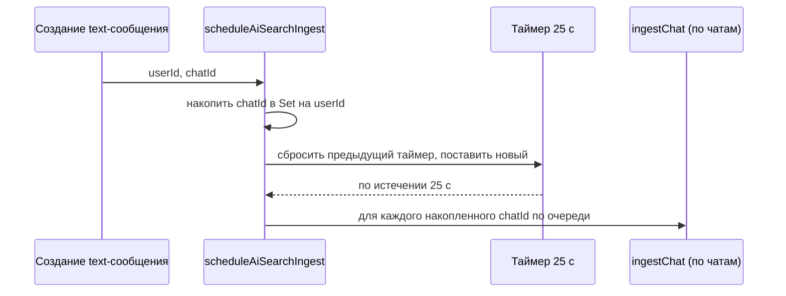

# Алгоритм AI Search (память диалогов и сигналы для таргетинга)

Документ описывает **как** система индексирует переписку без передачи целых чатов в модель при каждом запросе пользователя «найди в памяти» или при показе рекламы.

---

## 1. Цели

1. **Не скармливать модели весь архив** — только небольшие **инкрементальные** фрагменты после активности в чате.
2. **Два горизонта смысла:**
   - **Долгий** — темы чатов, устойчивые коммерческие и поведенческие интересы (БД).
   - **Короткий («горячий»)** — явное намерение «купить / выбрать сейчас» с ограниченным TTL (БД + быстрый кеш в памяти процесса).
3. **Поиск «что я терял»** — по **уже извлечённому индексу** (строки в Postgres), а не по полнотекстовому скану всех сообщений.

---

## 2. Условия включения

Индексация **не запускается**, если:

- нет `DATABASE_URL`;
- нет `OPENROUTER_API_KEY` (модель не вызывается);
- задано `AI_SEARCH_ENABLED=0`.

Пользователь должен быть **участником чата** (`chat_members`); иначе `ingest` сразу выходит.

---

## 3. Триггер и дебаунс

- После **каждого** нового **текстового** сообщения вызывается `scheduleAiSearchIngest(userId, chatId)` из `server/messages/service.ts`.
- На одного пользователя действует **один дебаунс ~25 с** (`server/ai-search/schedule.ts`): за это время накапливаются разные `chatId`, затем для **каждого** чата вызывается `ingestChat` **последовательно** (меньше параллельной нагрузки на API модели).

---

## 4. Выбор фрагмента сообщений (батч)

Для пары `(userId, chatId)` хранится **курсор** `last_created_at` в таблице `ai_search_chat_cursors`.

| Ситуация | Что читается из `messages` |
|----------|----------------------------|
| Курсор **есть** | До **40** (лимит зажат в коде до ~45) **новых** текстовых сообщений **после** курсора, по возрастанию времени. |
| Курсора **нет** (первый прогон) | **Последние** N текстовых сообщений того же лимита (порядок в батче — хронологический). |

Сообщения: `type = 'text'`, непустой `content` после trim. Учитываются только чаты, где пользователь — член.

После успешной обработки батча курсор обновляется на **максимальный `created_at`** среди сообщений батча (через `GREATEST` при конфликте — не откатывается назад).

---

## 5. Подготовка текста для модели

Строки батча склеиваются в короткий **транскрипт**: для каждого сообщения — метка времени, роль («Я» / «Собеседник» по `sender_id`), обрезка текста (~480 символов на реплику). В модель уходит префикс **до ~9000 символов** всего фрагмента (см. `extract-model.ts`).

---

## 6. Вызов LLM и структура ответа

Один запрос к OpenRouter: системный промпт требует **строго JSON** без markdown. Парсер (`parseExtractJson`) устойчив к обрывам: при ошибке JSON возвращается пустая структура.

Поля (все массивы могут быть пустыми):

| Поле | Смысл | Лимит в парсере | Куда пишется |
|------|--------|-----------------|--------------|
| `tags` | Темы диалога | до 8 | `ai_search_dialogue_tags` |
| `commercial` | Долгосрочная коммерция (бренды, услуги, покупки в целом) | до 5 | `ai_search_interests` (`kind = commercial`) |
| `behavioral` | Хобби, работа, привычки | до 5 | `ai_search_interests` (`kind = behavioral`) |
| `hot_now` | Явное намерение **сейчас / в ближайшие дни** (конкретный товар, выбор модели) | до 4 | `ai_search_hot_signals` |

Ключи `key` нормализуются в slug (латиница, дефисы) на сервере перед upsert.

---

## 7. Правила записи в БД

### 7.1 Теги — `ai_search_dialogue_tags`

- Уникальность: `(user_id, chat_id, tag_key)`.
- При повторе: увеличивается `hit_count`, обновляются `last_at`, `tag_label`, при необходимости `snippet`.

### 7.2 Интересы — `ai_search_interests`

- Уникальность: `(user_id, kind, label_key)`.
- При повторе: растёт `evidence_count`, `last_at`, `score = GREATEST(старое, новое)`, обновляется `label_display`.

### 7.3 Горячие сигналы — `ai_search_hot_signals`

- Уникальность: `(user_id, signal_key)`.
- При каждом upsert: `expires_at = now() + AI_SEARCH_HOT_TTL_HOURS` (часы, по умолчанию 48, диапазон в коде 1–168).
- При конфликте: снова продлевается TTL от **текущего** момента, `score = GREATEST(...)`, подтягиваются подпись и snippet.

---

## 8. Быстрое чтение «горячих» тем (L1)

Для эндпоинтов, которые часто дергаются (например, перед рекламой), список активных hot для `user_id` кешируется **в памяти процесса** на время `AI_SEARCH_HOT_L1_MS` (по умолчанию 45 с, с ограничениями в коде).

- При **любом** `upsert` горячего сигнала для пользователя кеш для него **инвалидируется**.
- В выборке из БД участвуют только строки с `expires_at > now()`.

**Ограничение:** при нескольких процессах Node (PM2 cluster) у каждого свой L1; для общего кеша между инстансами в перспективе — Redis или аналог.

---

## 9. Поиск и выдача контекста

| Действие | Алгоритм |
|----------|-----------|
| `GET /api/ai-search?q=` | ILIKE по `tag_label` / `tag_key` и по `label_display` / `label_key` в интересах; спецсимволы `%` `_` из запроса подавляются. |
| `GET /api/ai-search/hot` | Активные hot из L1 или Postgres, сортировка по `score`, затем `last_at`. |
| `GET /api/ai-search/ad-context` | Параллельно: hot + топ `commercial` + топ `behavioral` из `ai_search_interests`. |

---

## 10. Что алгоритм **не** делает

- Не индексирует не-текстовые типы сообщений в этом пайплайне.
- Не гарантирует полный **бэкфилл** старых сообщений без курсора: первый заход берёт только **последний** лимит сообщений; глубже история попадёт по мере новых сообщений или ручного `POST /api/ai-search/ingest-chat`.
- Не заменяет юридическую/продуктовую политику приватности: индекс строится из контента чатов, к которым пользователь уже имеет доступ как участник.

---

## 11. Связанные файлы

| Файл | Роль |
|------|------|
| `server/ai-search/schedule.ts` | Дебаунс и очередь чатов на пользователя |
| `server/ai-search/ingest.ts` | Батч → модель → upsert во все таблицы |
| `server/ai-search/repo.ts` | Курсор, выборка сообщений, теги, интересы, поиск |
| `server/ai-search/hot-signals.ts` | Hot в БД + L1 |
| `server/ai-search/extract-model.ts` | Промпт, вызов OpenRouter, парсинг JSON |
| `server/ai-search/routes.ts` | HTTP API |
| `scripts/migrate-ai-search.cjs` | Схема таблиц |

Краткий обзор для разработчиков: `server/ai-search/README.md`.
